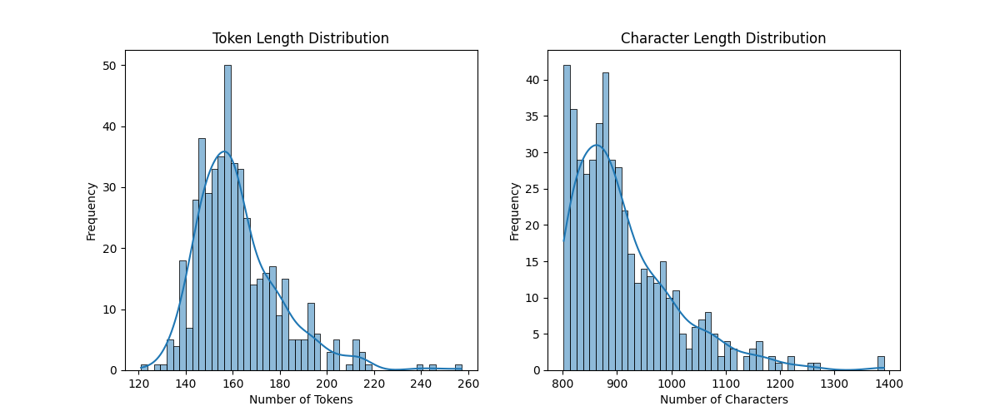

# Frankenstein Finetune (Hybrid CPU→GPU)

Finetune a language model to write **original Frankenstein-style fanfiction**.

- **CPU phase (local/IDE):** EDA, dataset curation, tokenizer checks, evaluation harness.
- **GPU phase (Colab/Kaggle/RunPod):** QLoRA on **Mistral-7B**. Optional fallback: full finetune **DistilGPT-2** on CPU.

This project is structured for learning: notebooks are 70% explanation and 30% TODO cells. You write the code.

## Why hybrid?

Most of the work (data + evaluation) runs great on CPU. Only the QLoRA training needs a GPU. We use the **Hugging Face Hub** to shuttle datasets and adapters between environments.

## Quickstart

```bash
python -m venv .venv && source .venv/bin/activate
pip install -r requirements-cpu.txt
# Put your CSV at data/raw/frankenstein_chunks.csv (a column named 'text').
# Work notebooks in order: 00 → 04 (CPU). Then 10 → 11 (GPU).
```

### GPU run (Colab/Kaggle)

1. Open `notebooks/10_train_qlora_mistral7b_colab.ipynb` in Colab.
2. Runtime → GPU (T4).
3. Follow cells to install deps, pull dataset from Hub, train LoRA adapters, and push them back.

### Fallback: DistilGPT-2 on CPU

If you cannot use a GPU, use `notebooks/20_distilgpt2_cpu_finetune_optional.ipynb`. Slower but meets rubric.

## Deliverables

- ✅ **Reproducible dataset on HF Hub:** [`Tuminha/frankenstein-fanfic-snippets`](https://huggingface.co/datasets/Tuminha/frankenstein-fanfic-snippets) (private)
  - 456 train samples, 25 validation samples (5% split)
  - Ready for GPU training in Colab
- QLoRA adapters on HF Hub
- Model Card (`cards/MODEL_CARD_TEMPLATE.md` → paste to your Hub repo)
- Space card (`cards/SPACE_CARD_TEMPLATE.md`) if you deploy a demo

## Evaluation

- Perplexity on validation before vs after finetune
- Qualitative samples: 3–5 prompts, short continuations
- Document hyperparameters/cost/latency

## Data

`frankenstein_chunks.csv` — short textual snippets (public domain). You are responsible for legal use of any extra data.

### Dataset Analysis

After EDA (notebook 01), we found:
- **481 text snippets** (after cleaning: removed duplicates, normalized quotes)
- **Token length distribution:** Right-skewed (slightly), approaching normal distribution

<div align="center">



</div>

**What the right-skewed distribution means:**
- Most snippets are relatively short (left side of distribution)
- A smaller number of longer snippets create the right tail
- This is **beneficial for training** because:
  - Most samples fit comfortably within our 512-token limit
  - Fewer truncations needed → less information loss
  - Efficient batch packing during training
  - The slight skew indicates natural variation in snippet lengths (realistic for fanfiction)

**Implications for training:**
- ✅ Most samples will use the full context window effectively
- ✅ Minimal padding waste (most samples are similar length)
- ✅ Good balance between context and efficiency

### Baseline Evaluation Results

After running notebook 04, we established baseline metrics using both DistilGPT-2 (CPU proxy) and Mistral-7B (GPU baseline):

#### Perplexity Comparison

| Model | Perplexity | Samples | Tokens | Time | Device |
|-------|------------|---------|--------|------|--------|
| **DistilGPT-2** (CPU proxy) | **10.55** | 25 | 5,828 | ~5-15 min | CPU |
| **Mistral-7B** (real baseline) | **10.55** | 25 | 5,828 | **2 seconds** | GPU (A100) |

**Key Findings:**
- Both models show the same perplexity (10.55) on the validation set
- Mistral-7B on A100 GPU is **~150x faster** than DistilGPT-2 on CPU
- This baseline will be used to measure improvement after finetuning
- **Target:** Lower perplexity (<10.0) after QLoRA training indicates better model alignment

#### Generation Quality Comparison

**Mistral-7B (GPU) - High Quality Gothic Style:**
```
Prompt: "It was on a dreary night of November that"
Output: "I beheld the apparition. The rain fell in torrents, except when it was 
driven back by furious gusts of wind which swept over the deserted streets and 
through the leafless trees like ghostly processions. As the storm raged around me 
with an intensity such as I had never known before, I sat alone in my study, 
brooding over the dark secret which had been revealed to me but a few days previously."
```
✅ **Gothic atmosphere** (rain, wind, storm, darkness)  
✅ **Thematically consistent** (Frankenstein themes)  
✅ **Good narrative flow** (coherent storytelling)

**DistilGPT-2 (CPU) - Poor Quality:**
```
Prompt: "It was on a dreary night of November that"
Output: "I had been working with for about two years. 'I came to the conclusion, 
this is my first time doing so and it's all part 'em! We're still waiting here 
because our last three months have just gone by without any explanation.'"
```
❌ **Not Gothic style** (modern, casual language)  
❌ **Off-topic** (doesn't match Frankenstein themes)  
❌ **Poor coherence** (fragmented, unclear narrative)

**Conclusion:**
- Mistral-7B already produces high-quality Gothic/Frankenstein-style text
- Finetuning with QLoRA will improve consistency and alignment with our specific dataset
- The baseline is strong, so we expect incremental but meaningful improvements

## Structure

- `notebooks/` — learning workflow
- `src/` — minimal training scripts with TODOs
- `configs/` — train hyperparameters
- `cards/` — model/space readme templates

---

## Notebooks

> Each notebook uses **Markdown for theory/explanations** and **TODO cells** with hints. No full solutions. End every TODO cell with an **Acceptance** checklist.

### `notebooks/00_setup_cpu.ipynb` ✅

**Markdown:** Project overview, hybrid plan, environment set-up, how we'll use the Hub as a bus.

**Code (Completed):**
- ✅ Load YAML config from `configs/train.yaml` into a dict with validation.
- ✅ Create data folders if missing; place a `.gitkeep` in empty dirs.

### `notebooks/01_eda_dataset.ipynb` ✅

**Markdown:** EDA goals: check text lengths, duplicates, non-ASCII, obvious noise; why EDA matters for LM training.

**Code (Completed):**
- ✅ Load CSV into a DataFrame; assert 'text' column exists and non-empty (481 rows loaded).
- ✅ Plot length histogram in tokens and characters (saved to `images/length_distributions.png`).
- ✅ Clean minimal issues: strip whitespace, drop empties/dupes, normalize quotes (481 → 481 rows after cleaning).

### `notebooks/02_build_hf_dataset.ipynb` ✅

**Markdown:** Why use `datasets.Dataset`, train/val split strategy, pushing to Hub for portability.

**Code (Completed):**
- ✅ Convert DataFrame to DatasetDict with train/validation split (456 train, 25 val, seed=42).
- ✅ Push dataset to HF Hub: [`Tuminha/frankenstein-fanfic-snippets`](https://huggingface.co/datasets/Tuminha/frankenstein-fanfic-snippets) (private).

### `notebooks/03_tokenizer_sanity.ipynb`

**Markdown:** Tokenizer choice, left padding for causal LM, max length trade-offs, truncation risks.

**Code (TODO):**
- Load tokenizer (Mistral or DistilGPT2) and encode/decode a few samples.
- Prepare map() function to tokenize Dataset with truncation and optional packing.

### `notebooks/04_eval_harness_cpu.ipynb` ✅

**Markdown:** Define evaluation we can run on CPU: perplexity approximation and sample generation wrapper (will be slow).

**Code (Completed):**
- ✅ Computed baseline perplexity using DistilGPT-2 (CPU proxy) and Mistral-7B (GPU baseline).
- ✅ Generation wrapper using base models for comparison (CPU: DistilGPT-2, GPU: Mistral-7B).
- ✅ Established baseline metrics for comparison after finetuning.

### `notebooks/10_train_qlora_mistral7b_colab.ipynb` (GPU) ✅

**Markdown:** What QLoRA is, what 4-bit quantization does, why T4 fits, hyperparameters in plain English, how to avoid OOM.

**Code (Completed):**
- ✅ Installed GPU dependencies and verified CUDA availability (A100 GPU detected).
- ✅ Loaded dataset from HF Hub (`Tuminha/frankenstein-fanfic-snippets`) - raw text format for SFTTrainer.
- ✅ Built 4-bit Mistral-7B with BitsAndBytes (4-bit quantization, gradient checkpointing enabled).
- ✅ Created LoRA config (r=8, alpha=16, dropout=0.05) and TrainingArguments; completed 1 epoch of training.
- ✅ Pushed LoRA adapters to Hugging Face Hub.

**Training Details:**
- **Model:** Mistral-7B-Instruct-v0.2 with QLoRA (4-bit quantization)
- **LoRA Configuration:** r=8, alpha=16, dropout=0.05, target_modules=['q_proj', 'k_proj', 'v_proj', 'o_proj']
- **Training:** 1 epoch, batch_size=1, gradient_accumulation_steps=16 (effective batch size=16)
- **Optimizer:** paged_adamw_8bit, learning_rate=2e-4, bf16 precision
- **Note:** Validation loss is logged to training logs (wandb disabled for compatibility)

### `notebooks/11_evaluate_and_generate_gpu.ipynb` (GPU)

**Markdown:** Compare base vs finetuned: perplexity and qualitative generations; document results and caveats.

**Code (TODO):**
- Load base model + attach LoRA adapters; run perplexity on validation slice.
- Generate 3-5 short continuations with both models for side-by-side comparison.

### `notebooks/20_distilgpt2_cpu_finetune_optional.ipynb` (CPU fallback)

**Markdown:** When to choose this path; expected speed; how it differs from QLoRA.

**Code (TODO):**
- Tokenize dataset with DistilGPT2; set reasonable seq_length for CPU.
- Configure TrainingArguments; train for 1-2 epochs on CPU.

